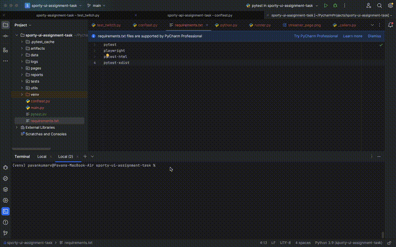

# Sporty Group – Twitch UI Automation Assignment

This repository contains automated test scripts developed as part of the QA assignment.  
The tests are written using **Pytest** and **Playwright**.

---

## Test Execution Demo

Below is a short GIF showing the tests running locally:



---

## Repository Structure

```
├── tests/
│   ├── test_twitch.py           # UI test cases
│   
├── pages/
│   ├── base.py                  # base page
│   ├── browse_directory_page.py # page object model for 'browse directory page' 
│   ├── home_page.py             # page object model for 'home page'
│   ├── search_results.py        # page object model for 'search results page'
│   ├── streamer.py              # page object model for 'streamer page'
│
├── utils/
│   ├── ui_test_utils.py         # UI helper functions
│ 
├── data/
│   └── constants.py              # Test data and constants
│ 
│── logs/
│   └── test_log.log              # Log file - test execution run
│ 
├── pytest.ini                    # Default pytest configuration
├── requirements.txt              # Python dependencies
├── readme.md                     # Project documentation (this file)
|
|── artifacts/
│   └── screenshots               # folder for storing screenshots
│   └── html_report.html          # html report location generated by pytest-html plugin
|
└── assets/
    └── test_run.gif              # Test execution GIF - used in readme
```

---

## Setup & Execution

### 1. Clone repo
```bash
git clone https://github.com/pavanmadrid88/twitch-ui-test-automation.git
cd twitch-ui-test-automation
```

### 2. Install dependencies
- Make sure python is available in the system
```bash
python --version
pip install -r requirements.txt
```

### 3. Run all tests
```bash
pytest -n auto --html=artifcats/report.html --self-contained-html
```
- -n auto → Runs tests in parallel using all available CPU cores (via pytest-xdist).
- --html=artifacts/report.html → Generates an HTML test report named report.html under artifacts directory.
- --self-contained-html → Embeds all CSS and JS into the report so it’s fully standalone
- If you don’t specify any arguments when running pytest, the default options defined in the pytest.ini file will be used.

### 4. Generate HTML report
After test execution, the HTML report will be automatically generated in the **artifacts** directory.

---

## Notes
- The framework uses **Pytest** as test runner and **Playwright** for browser automation.
- **conftest.py** — provides Playwright pytest fixtures (pw, browser, context, page), CLI options (--device, --headless),
  logging fixture, and a failure hook that captures/attaches screenshots to pytest-html report file.
- Page Object Model design pattern is followed in the framework.
- **BasePage** class encapsulates common browser actions such as clicking, typing, waiting for elements, and navigation.
- Each individual page (e.g., HomePage, StreamerPage etc) inherits from **BasePage**, ensuring code re-usability and 
  consistency across tests.
- Under utils directory -> **ui_test_utils.py** includes a **get_logger()** helper for consistent logging across tests
  and can be extended with additional UI utilities.
- Logs are stored in **/logs/** directory.
- **HTML report** & all **screenshots** captured during test execution are stored under the **artifacts** directory.
---

